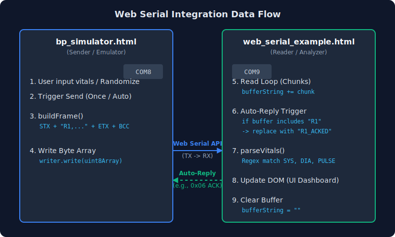
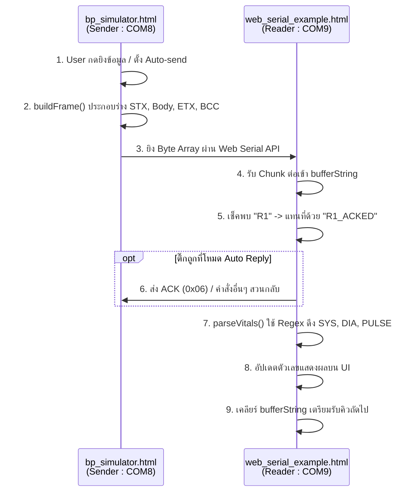

# การเชื่อมต่อและการทำงานระหว่าง `bp_simulator.html` และ `web_serial_example.html`

เอกสารนี้จัดทำขึ้นสำหรับ Developer เพื่อให้เข้าใจกระบวนการทำงานแบบ End-to-End ระหว่างฝั่งส่งข้อมูล (Simulator) และฝั่งรับข้อมูล (Reader) ซึ่งทั้งสองโปรแกรมใช้ **Web Serial API** ในการสื่อสารผ่าน Serial Port ของเบราว์เซอร์

## ภาพรวมสถาปัตยกรรม (Architecture Overview)
- **Sender:** `bp_simulator.html` สร้างและส่งข้อมูลเลียนแบบเครื่อง Terumo รุ่น BR-500 (ใช้รูปแบบ R1 Frame)
- **Receiver:** `web_serial_example.html` เป็นตัวรับข้อมูลดิบ, ตรวจจับ Frame, และนำค่าไปแสดงผล
- **Transport Layer:** สื่อสารผ่าน Serial Port (ในการ Dev นิยมใช้ Virtual Serial Port เช่น `com0com` จับคู่ `COM8 <-> COM9`)

---

## 1. การทำงานของฝั่งจำลอง `bp_simulator.html`
ไฟล์นี้รับผิดชอบการ **สร้างข้อมูล (Frame Builder)** และ **ส่งออกทาง Serial Port (TX)**

### โครงสร้างข้อมูลที่ส่ง (Payload Format)
ระบบจำลองโปรโตคอล Terumo (R1 Frame) โดยมีโครงสร้างดังนี้:
1. `STX` (Start of Text - `0x02`)
2. ตัวข้อความ Body (ASCII) เช่น `R1,000000000,260513,103000,120,093,080,075,0000,0000,00000,000`
   - ข้อมูลแบ่งด้วยเครื่องหมายจุลภาค (Comma `,`)
   - ลำดับข้อมูลที่สำคัญ: `R1`, `Device ID`, `Date`, `Time`, `SYS`, `MAP`, `DIA`, `PULSE`
3. `ETX` (End of Text - `0x03`)
4. `BCC` (Block Check Character) ซึ่งคำนวณจากผลรวมของ Byte ตั้งแต่ STX + Body + ETX แล้วทำ AND กับ `0xFF`

### โค้ดที่สำคัญที่ Dev ควรดู
- ฟังก์ชัน `buildFrame()`: ใช้แพ็กข้อมูล SYS, DIA ลง Byte Array (`Uint8Array`) ก่อนส่งให้ `writer.write()`
- ฟีเจอร์ Random & Presets: ผู้ใช้จำลองค่าความดันแบบผิดปกติเพื่อทดสอบ UI ฝั่ง Reader ได้อย่างอิสระ

---

## 2. การทำงานของฝั่งรับ `web_serial_example.html`
ไฟล์นี้รับผิดชอบการ **รับข้อมูล (RX)**, **วิเคราะห์ (Parsing)**, และ **ตอบกลับ (Auto-Reply)**

### กระบวนการทำงาน (Read Loop Flow)
1. **Read Loop:** ฟังก์ชัน `readLoop()` จะใช้ `port.readable.getReader().read()` วนรับข้อมูลแบบ Chunk เข้ามาเรื่อยๆ จนกว่าพอร์ตจะปิด
2. **Buffering:** นำข้อความ Chunk (หลังแปลงด้วย `TextDecoder("ascii")`) มาต่อท้ายตัวแปรระดับ Global ชื่อ `bufferString`
3. **Auto Reply:**
   - เช็คว่าใน `bufferString` มีคำว่า `"R1"` โผล่มาหรือไม่
   - หากมีและติ๊กเปิด Auto-Reply ไว้ โปรแกรมจะใช้คำสั่ง `sendData()` เพื่อส่ง Frame ตอบกลับ (เช่น ส่ง `ACK` หรือ Frame `D1`) กลับไปหา Simulator
   - หลังจากเจอ `"R1"` ระบบจะ replace คำนี้เป็น `"R1_ACKED"` ในบัฟเฟอร์ เพื่อป้องกันการสแปมข้อความตอบกลับซ้ำเดิม
4. **Parsing:**
   - ทำงานในฟังก์ชัน `parseVitals()` โดยใช้ **Regex** ตรวจจับตัวเลข:
     ```javascript
     let terumoMatch = bufferString.match(/R1(?:_ACKED)?,[^,]*,[^,]*,[^,]*,(\d{2,3}),(?:\d{2,3}),(\d{2,3}),(\d{2,3}),/);
     ```
   - ถ้า Regex เจอค่าที่ตรงกัน ระบบจะสกัดค่า `SYS` (group 1), `DIA` (group 2), และ `PULSE` (group 3) ออกมาแล้วนำไปยัดลง DOM
5. **Clear Buffer:** เมื่อนำค่าขึ้นหน้าจอสำเร็จ ระบบจะสั่ง `bufferString = ""` ทิ้ง เพื่อเคลียร์พื้นที่รองรับคิวการยิงข้อมูลครั้งถัดไป

---

## 3. ขั้นตอนสำหรับ Development & Testing 
สำหรับ Dev ที่รับงานต่อ ให้ตั้งค่าทดสอบระบบดังนี้:

1. **เปิด Virtual Port:** รันโปรแกรม **com0com** เพื่อจำลอง Port แบบจับคู่ (เช่น `COM8` และ `COM9`)
2. **เปิด Web Server:** ห้ามเปิดไฟล์ `.html` ตรงๆ (Double-click) เพราะ Web Serial API ต้องการ HTTPS หรือ Localhost เสมอ ให้ใช้ Live Server (VS Code) หรือคำสั่ง `python -m http.server`
3. **เปิด Browser 2 แท็บ:**
   - แท็บแรก: รัน `bp_simulator.html` แล้ว Connect ไปที่ `COM8` (Baud `19200`)
   - แท็บสอง: รัน `web_serial_example.html` แล้ว Connect ไปที่ `COM9` (Baud `19200`)
4. **ทดสอบส่งข้อมูล:** 
   - ลองส่งค่า Normal, Crisis จาก `bp_simulator` ดู
   - สังเกตการไหลของข้อมูลใน Terminal Log ฝั่ง `web_serial_example` และดูว่าค่าโชว์บน Dashboard ทันทีหรือไม่

## แผนภาพการสื่อสาร (Integration Data Flow)



### แผนภาพแบบข้อความ (Mermaid Sequence Diagram)

