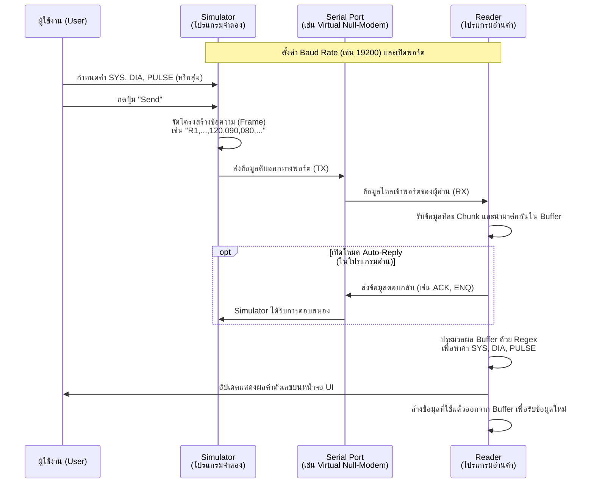

# การทำงานของระบบจำลอง (Simulator) และตัวอ่านค่า (Reader)

เอกสารนี้อธิบายกระบวนการทำงานและสื่อสารกันระหว่าง 2 โปรแกรม คือ **โปรแกรมจำลองเครื่องวัดความดัน (Simulator)** และ **โปรแกรมอ่านค่า (Reader)** ผ่านพอร์ตซีเรียล (Serial Port)

## 1. โปรแกรมจำลอง (Simulator)
- **หน้าที่:** ทำหน้าที่แทนเครื่องวัดความดันโลหิต (เช่น Terumo BR-500)
- **การทำงาน:**
  - ให้ผู้ใช้สามารถจำลองค่าความดัน (SYS, DIA) และชีพจร (PULSE) ได้จากการกรอกเอง หรือกดสุ่ม (Random)
  - ผู้ใช้สามารถส่งข้อมูล 1 ครั้ง หรือตั้งค่าให้ส่งอัตโนมัติ (Auto-send) ตามเวลาที่กำหนด
  - โปรแกรมจะนำข้อมูลมาจัดรูปแบบเป็นข้อความ (String/ASCII Frame) เช่น รูปแบบที่ขึ้นต้นด้วย `R1,...` หรือแบบแยกบรรทัด `SYSTOLIC,120,mmHg` แล้วแปลงเป็น Byte ส่งออกไปยังพอร์ต Serial

## 2. โปรแกรมอ่านค่า (Reader / Web Serial)
- **หน้าที่:** ทำหน้าที่รับข้อมูลจากพอร์ต Serial (เช่น ผ่าน Web Serial API ในเบราว์เซอร์ หรือด้วย Python)
- **การทำงาน:**
  - เชื่อมต่อพอร์ต Serial ที่จับคู่กับ Simulator (เช่น ใช้ com0com จับคู่ COM8 กับ COM9)
  - ดึงข้อมูลจาก Serial Port อย่างต่อเนื่อง โดยข้อมูลมักจะถูกอ่านมาเป็น Chunk (ส่วนเล็กๆ) แล้วนำมาต่อกันเก็บไว้ในตัวแปรสะสม (Buffer)
  - **Auto-Reply (ตอบกลับอัตโนมัติ):** หากพบคำสั่งจากเครื่องที่ต้องการการตอบรับ (เช่น เจอคำว่า `R1`) โปรแกรมสามารถตอบกลับทันที (เช่น ส่ง `ACK`, `NAK`, `ENQ` หรือ Frame ตอบกลับเฉพาะ)
  - **Parsing (สกัดข้อมูล):** ใช้กลไกการจับรูปแบบคำ (Regular Expression / Regex) ในการค้นหาและแยกค่าความดันตัวบน (SYS), ความดันตัวล่าง (DIA) และชีพจร (PULSE) ออกมาจากข้อความที่สะสมไว้ใน Buffer
  - อัปเดตตัวเลขขึ้นบนหน้าจอ UI สรุปผล (Terminal Log) และเคลียร์ข้อมูลที่ใช้แล้วออกจาก Buffer เพื่อรอรับข้อมูลชุดถัดไป

---

## แผนภาพการทำงาน (Sequence Diagram)

### สรุปขั้นตอนหลักในการรับส่ง
1. **การสร้างข้อมูล (Simulator):** ระบบนำค่าตัวเลขที่ผู้ใช้กรอก มาจัดเรียงตาม Protocol (แบบ Terumo) แล้วเปลี่ยนเป็นข้อความ (String)
2. **เส้นทางข้อมูล (Communication):** ข้อมูลตัวอักษรจะถูกส่งเป็น Byte ข้ามผ่าน Serial Port ซึ่งต้องมีการตั้งค่า Baud Rate, Data Bits, Parity ให้ตรงกันทั้งสองฝั่ง
3. **การประมวลผล (Reader):** ตัวอ่านค่าจะรับ Byte เหล่านั้นแปลงกลับเป็น String ต่อข้อความจนสมบูรณ์ กรองแยกเฉพาะตัวเลข และตอบกลับ (Acknowledge) เครื่องจำลอง
4. **การแสดงผล:** เมื่อการดึงข้อมูลสำเร็จ ระบบจะแสดงผลค่าสัญญาณชีพบน UI ทันที
